# Projeto `Untitled City Game`.

# Descrição
O `Untitled City Game` é um jogo de construção de cidades em que o jogador deve assumir o papel de um prefeito e organizar sua cidade de modo a fazer com que ela prospere e que sua população fique satisfeita. Portanto, o jogo tem como próposito fazer com o que o jogador entenda como planejar de maneira eficiente e criativa o arranjo de construções da cidade fazendo com que ela progrida de acordo com as regras de jogo. 

# Equipe
* `Riccardo Carvalho Sofer - RA 247362`
* `Pedro Carvalho Cintra - RA 247315`

# Slides do projeto
[Link Slides](https://docs.google.com/presentation/d/1TJfkO0ycISbAXsCrqyaSoHrUhCPaGAkyrBRW4GFfrWY/edit?usp=sharing)

# Arquivo executável do jogo

[jar](src/desktop/build/libs)

# Para jogar...
Para jogar, baixe o arquivo [jar](src/desktop/build/libs) e, em um terminal, navegue até o diretório o qual o arquivo jar foi salvo e insira o seguinte comando: 
`java -jar desktop-1.0.jar`

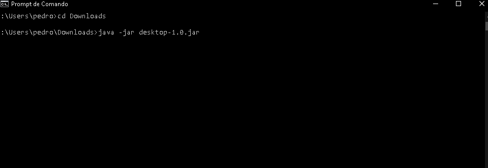

Observação: você deve ter o JDK instalado em sua máquina.

# Mecânica do Jogo 
Descrever (detalhadamente) mecânicas do jogo

# Relatório de Evolução
A ideia geral do jogo permaneceu a mesma durante a maioria do desenvolvimento, e de fato isso é visível se compararmos o primeiro diagrama imaginário de arquitetura (visto nos slides da apresentação introdutória) e o diagrama de de arquitetura final do projeto. Porém, isso não significa que houveram desafios, e várias mudanças precisaram ser feitas.

A maior dificuldade foi o tempo, em especial pela escolha do grupo de usar o framework LibGDX. Apesar de muito poderoso, aprender a usar o framework demandou muito tempo, o que acabou prejudicando certos aspectos do jogo. Alguns conceitos, como dificuldade, tiveram que ser cortados inteiramente, e certas simplificações foram adotadas para obter maior funcionalidade do framework.
	
Algumas outras decisões, dessa vez positivas, foram tomadas durante o rumo. Vimos que certos design patters facilitariam muito em algumas partes do jogo. Por exemplo, a adoção de Strategies para eventos aleatórios significou muita agilidade em criar esses eventos. Ademais, o uso de Factories facilita a adição de novas construções no futuro, padronizando a criação de objetos. Por fim, optamos por separar nosso Controle de Jogo em vários subcontroles, que, apesar de interligados por interfaces, permitem correções e alterações de maneira mais ágil. Por exemplo, se quisermos mudar algo no calendário do jogo, precisariamos apenas alterar o Subcontrole relacionado ao mesmo.
	
Existem uma série de melhorias que poderiam ainda ter sido realizadas no projeto, mas que por questões de tempo não foram possíveis. Existem alguns problemas de encapsulamento e formatação de componentes, os quais comprometem um pouco a arquitetura geral do jogo. O grupo não teve muito tempo disponível para refatorar o código, o que gerou esses problemas. Mesmo assim, sabemos que essas correções são impotantes, mas que infelizmente tiverem que ser deixadas de lado para priorizar o funcionamento básico do jogo.
	
Aprendemos muito com esse projeto, desde o uso de design patterns, até como trabalhar com arquiteturas complexas e também fazer decisões em equipe para agiliar a criação, sempre dividindo tarefas com base na especialidade de cada membro. Estamos certos de que essas habilidades e conhecimentos serão de grande uso no futuro, seja na faculdade ou fora da vida acadêmica.

# Diagramas
## Diagrama geral de Arquitetura do Jogo

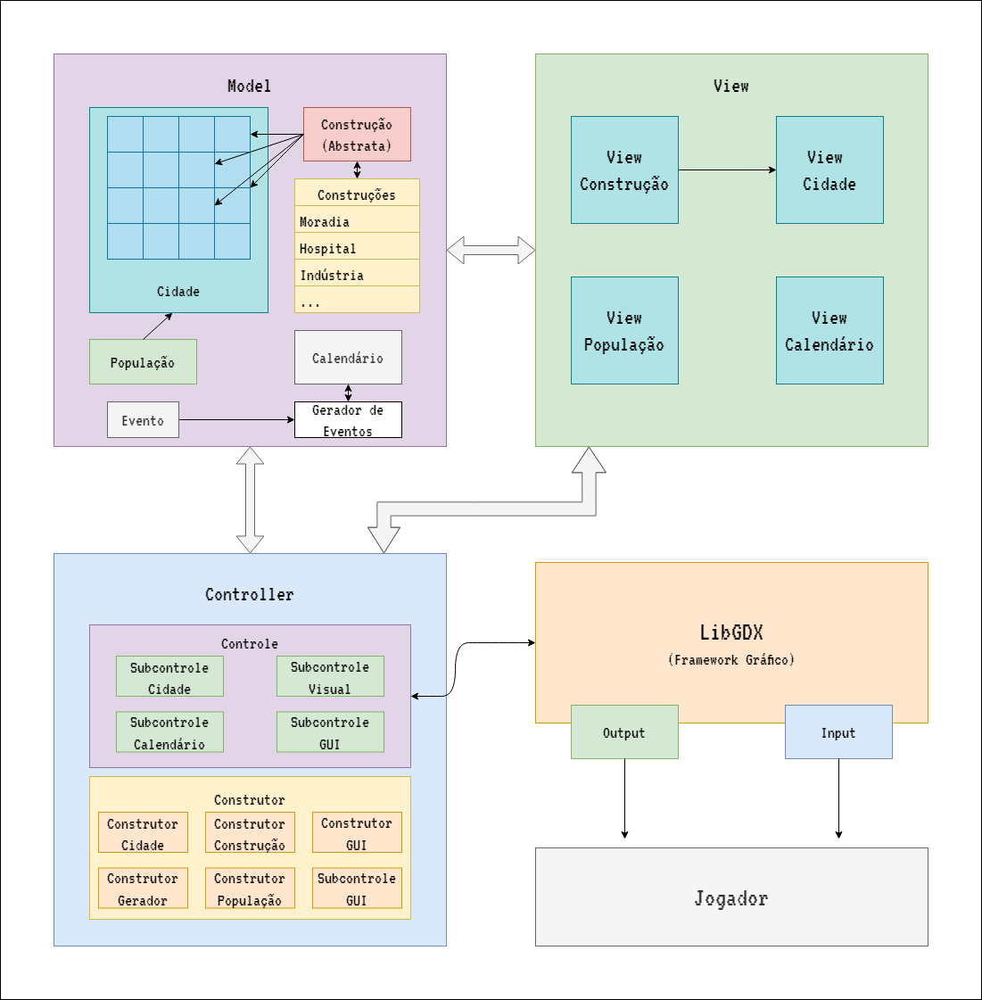

## Diagrama geral de Componentes  

## Componente `Cidade`
Componente que contem o layout de construcoes.

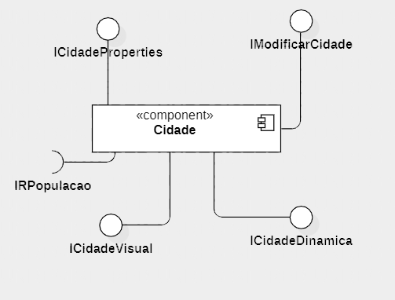

**Ficha Técnica**
item | detalhamento
----- | -----
Classe | Cidade: `com.projeto.game.model.cidade`
Autores | Riccardo Carvalho Sofer e Pedro Carvalho Cintra
Interfaces | `ICidade, ICidadeVisual, IRPopulacao, ICidadeProperties, IModificarCidade, ICidadeDinamica `

### interfaces 
> interfaces associadas a esse componente

> interface agregador do componente em java
~~~java
public interface ICidade extends ICidadeVisual, IRPopulacao, ICidadeProperties, IModificarCidade, ICidadeDinamica {
}
~~~

### Detalhamento das interfaces

#### Interface `ICidadeVisual`
Interface responsável pela criação visual da cidade e do dinheiro.

~~~java
package com.projeto.game.model.cidade;
…
public interface ICidadeVisual {
	public Table criarCidadeVisual();
	public Group criarDinheiroVisual();
}
~~~

Método | Objetivo
-------| --------
`criarCidadeVisual` | método que cria uma Table, configura suas dimensões e a retorna.
`criarDinheiroVisual` | método que cria um Group que contém o ícone e o texto referentes ao dinheiro e o retorna.

#### Interface `IRPopulacao`
Interface responsável por conectar populacao na cidade.

~~~java
package com.projeto.game.model.cidade;
…
public interface IRPopulacao {
    public void connectPopulacao(IPopulacao populacao);
}
~~~

Método | Objetivo
-------| --------
`connectPopulacao` | método que recebe a interface IPopulacao como parâmetro e a conecta com a cidade.

#### Interface `ICidadeProperties`
Interface responsável pelos métodos relacionados as propriedades da cidade.

~~~java
package com.projeto.game.model.cidade;
…
public interface ICidadeProperties {
	public float getDinheiro();
	public IConstrucao[][] getLayout();
	public void setLayout(IConstrucao[][] layout);
	public IPopulacao getPopulacao();
	public void setDinheiro(float dinheiro);
	public void setLabel(Label label);
	public Label getLabel();
	public float getRenda();
	public void setRenda(float renda);
}
~~~

Método | Objetivo
-------| --------
`getDinheiro` | método que retorna o dinheiro da cidade.
`getLayout` | método que retorna o layout da cidade.
`setLayout` | método que recebe como parâmetro uma matriz de IConstrucao e a defini no atributo layout da cidade.
`getPopulacao` | método que retorna a populacao da cidade.
`setDinheiro` | método que recebe como parâmetro um float e o defini no atributo dinheiro da cidade.
`setLabel` | método que recbe como parâmetro um Label e o defini no atributo label da cidade.
`getLabel` | método que retorna o label da cidade.
`getRenda` | método que retorna a renda da cidade.
`setRenda` | método que recebe como parâmetro um float e o defini no atributo renda da cidade.

#### Interface `IModificarCidade`
Interface responsável pela adição e remoção de construcao na cidade.

~~~java
package com.projeto.game.model.cidade;
…
public interface IModificarCidade {
	public void adicionarConstrucao(IConstrucao construcao);
	public void removerConstrucao(int linha, int coluna);
}
~~~

Método | Objetivo
-------| --------
`adicionaConstrucao` | método que realiza a construção de uma nova construcao na cidade, realizando as alterações necessárias na cidade.
`removerConstrucao` | método que realiza a demolição de uma construcao na cidade, realizando as alterações necessárias na cidade.

#### Interface `ICidadeDinamica`
Interface responsável pelas interações com a cidade.

~~~java
package com.projeto.game.model.cidade;
…
public interface ICidadeDinamica {
	public int numMoradiasVizinhas(IConstrucao construcao);
	public void interacoesMoradiaConstruiu(IConstrucao construcao);
	public int acharDecrescimos(IConstrucao moradia);
	public void interacoesMoradiaPassouDia();
	public void passarDia();
}
~~~

Método | Objetivo
-------| --------
`numMoradiasVizinhas` | método que recebe como parâmetro uma IConstrucao e retorna a quantidade de construções do tipo Moradia ao redor.
`interacoesMoradiaConstruiu` | método que realiza a interação, nesse caso a possível adição de satisfacao da populacao, após uma construcao ser construída.
`acharDecrescimos` | método que recebe como parâmetro uma IConstrucao do tipo Moradia e retorna a quantidade de decrèscimos, nesse caso a quantidade de construções do tipo Industria.
`interacoesMoradiaPassouDia` | método que passa por todas as contruções do tipo Moradia e realiza os decrésimos de satisfacao da populacao.
`passarDia` | método que realiza os efeitos na cidade ao passar o dia.

## Componente `construcao`
Componente que representa as construções da cidade.

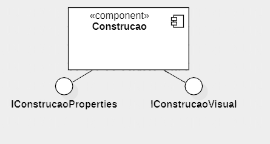

**Ficha Técnica**
item | detalhamento
----- | -----
Classe | Construcao: `com.projeto.game.model.construcao` (abstract class)
Subclasses (Construcao) | Escola, Moradia, Mercado, Industria, Prefeitura, Hospital e Vazio 
Autores | Riccardo Carvalho Sofer e Pedro Carvalho Cintra
Interfaces | `IConstrucao, IConstrucaoProperties, IConstrucaoVisual`

### interfaces 
> interfaces associadas a esse componente

> interface agregador do componente em java
~~~java
package com.projeto.game.model.construcao;

public interface IConstrucao extends IConstrucaoProperties, IConstrucaoVisual {
}
~~~

### Detalhamento das interfaces

#### Interface `IConstrucaoProperties`
Interface responsável pelos métodos relacionados as propriedades da construcao.

~~~java
package com.projeto.game.model.construcao;
…
public interface IConstrucaoProperties {
    public int getLinha();
    public void setLinha(int linha);

    public int getColuna();
    public void setColuna(int coluna);
    
    public float getPreco();
    public void setPreco(float preco);
    
    public int getSatisfacao();
    public void setSatisfacao(int satisfacao);
    
    public float getRenda();
    public void setRenda(float renda);
    
    public boolean getConstruido();
    public void setConstruido(boolean estado);
    
    public Button getBotao();
    public void setBotao(Button botao);
    
    public Window getJanela();
    public void setJanela(Window janela);
    
    public abstract String getTipo();
    public abstract int getTempoConstrucao();
}
~~~

Método | Objetivo
-------| --------
`getLinha` | método que retorna a posição da linha da construcao.
`setLinha` | método que recebe como parâmetro um int e o defini no atributo linha da construcao.
`getColuna` | método que retorna a posição da coluna da construcao.
`setColuna` | método que recebe como parâmetro um int e o defini no atributo coluna da construcao.
`getPreco` | método que retorna o preco da construcao.
`setPreco` | método que recebe como parâmetro um float e o defini no atributo preco da construcao.
`getSatisfacao` |  método que retorna a satisfacao associada à construcao.
`setSatisfacao` | método que recebe como parâmetro um int e o defini no atributo satisfacao da construcao.
`getRenda` |  método que retorna a reanda da construcao.
`setRenda` | método que recebe como parâmetro um float e o defini no atributo renda da construcao.
`getConstruido` |  método que retorna a estado estado construido da construcao .
`setConstruido` | método que recebe como parâmetro um boolean e o defini no atributo construido da construcao.
`getBotao` |  método que retorna o botão associado à construcao.
`setBotao` | método que recebe como parâmetro um Button e o defini no atributo botao da construcao.
`getJanela` |  método que retorna a janela associada à construcao.
`setJanela` | método que recebe como parâmetro uma Window e a defini no atributo janela da construcao.
`getTipo` |  método (abstract) que retorna uma String representando o tipo da construcao.
`getTempoConstrucao` |  método (abstract) que retorna o tempo para construir a construcao.

#### Interface `IConstrucaoVisual`
Interface responsável pela criação visual das construções.

~~~java
package com.projeto.game.model.construcao;
…
public interface IConstrucaoVisual {
	public Group criarConstrucaoVisual();
}
~~~

Método | Objetivo
-------| --------
`criarConstrucaoVisual` | método que cria um Group que contém .

## Componente `calendario`
Componente que

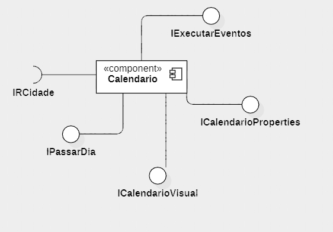

**Ficha Técnica**
item | detalhamento
----- | -----
Classe | Construcao: `com.projeto.game.model.calendario` 
Autores | Riccardo Carvalho Sofer e Pedro Carvalho Cintra
Interfaces | `ICalendario, IRCidade, IPassarDia, ICalendarioVisual, IExecutarEventos, `

### interfaces 
> interfaces associadas a esse componente

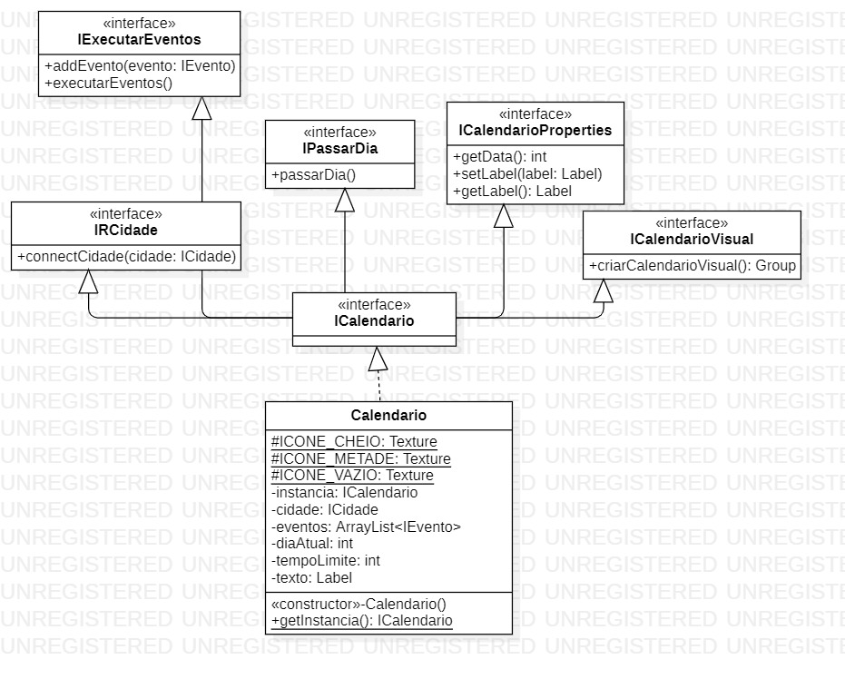

> interface agregador do componente em java
~~~java
package com.projeto.game.model.calendario;

public interface ICalendario extends IRCidade, IPassarDia, ICalendarioVisual, IExecutarEventos, ICalendarioProperties {
}
~~~

### Detalhamento das interfaces

#### Interface `IRCidade`
Interface responsável por conectar a cidade no calendario.

~~~java
package com.projeto.game.model.calendario;
…
public interface IRCidade {
	public void connectCidade(ICidade cidade);
}
~~~

Método | Objetivo
-------| --------
`connectCidade` | método que recebe a interface ICidade como parâmetro e a conecta com o calendario.

#### Interface `IPassarDia`
Interface responsável por passar o dia e acionar as modificações ao passar o dia.

~~~java
package com.projeto.game.model.calendario;

public interface IPassarDia {
	public void passarDia();
}
~~~

Método | Objetivo
-------| --------
`passarDia` | método que realiza a alteração do dia do calendario, pede para que cidade realiza as modificações necessárias ao passar o dia e aciona a execução de eventos.

#### Interface `ICalendarioVisual`
Interface responsável pela criação visual do calendario.

~~~java
package com.projeto.game.model.calendario;
…
public interface ICalendarioVisual {
	public Group criarCalendarioVisual();
}
~~~

Método | Objetivo
-------| --------
`criarCalendarioVisual` | método que cria um Group, adiciona os icones padrôes e o retorna.

#### Interface `IExecutarEventos`
Interface responsável por adicionar e executar os eventos do calendário.

~~~java
package com.projeto.game.model.calendario;
…
public interface IExecutarEventos {
	public void addEvento(IEvento evento);
	public void executarEventos();
}
~~~

Método | Objetivo
-------| --------
`addEvento` | método que adiciona eventos a lista de eventos.
`executarEventos` | método percorre a lista de eventos e aciona a execução dos eventos do dia.

#### Interface `ICalendarioProperties`
Interface responsável pelos métodos relacionados as propriedades do calendario.

~~~java
package com.projeto.game.model.calendario;
…
public interface ICalendarioProperties {
	public int getData();
    public void setLabel(Label label);
    public Label getLabel();
}
~~~

Método | Objetivo
-------| --------
`getData` | método que retorna a diaAtual do calendario.
`setLabel` | método que recebe como parâmetro uma Label e o defini no atributo texto da construcao.
`getLabel` | método que retorna o texto do calendario.

## Componente `gerador`
Componente que representa o ambiente de geração de eventos no jogo.

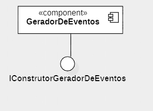

**Ficha Técnica**
item | detalhamento
----- | -----
Classes | ConstrutorGeradorDeEventos : `com.projeto.game.model.gerador`; GeradorEventoAleatorio : `com.projeto.game.model.gerador`; GeradorEventoConstrucao  : `com.projeto.game.model.gerador`
Autores | Riccardo Carvalho Sofer e Pedro Carvalho Cintra
Interfaces | `IConstrutorGeradorDeEventos, IGerarEventoAleatorio, IGerarEventoConstrucao`

### interfaces 
> interfaces associadas a esse componente

### Detalhamento das interfaces

#### Interface `IConstrutorGeradorDeEventos`
Interface responsável por acionar a criarção de eventos.

~~~java
package com.projeto.game.model.gerador;
…
public interface IConstrutorGeradorDeEventos {
	public IEvento criarEventoAleatorio(int data);
    public IEvento criarEventoConstrucao(IConstrucao construcao, int data);
}
~~~

Método | Objetivo
-------| --------
`criarEventoAleatorio` | método que aciona a geração de um evento aleatorio.
`criarEventoConstrucao` | método que aciona a geração de um evento construcao.

#### Interface `IGerarEventoAleatorio`
Interface responsável por gerar e definir o evento aleatorio.

~~~java
package com.projeto.game.model.gerador;
…
public interface IGerarEventoAleatorio{
    public EventoAleatorio gerarEventoAleatorio(int data);

}
~~~

Método | Objetivo
-------| --------
`gerarEventoAleatorio` | método que cria e defini um novo evento aleatorio.

#### Interface `IGerarEventoAleatorio`
Interface responsável por gerar e definir o evento construcao.

~~~java
package com.projeto.game.model.gerador;
…
public interface IGerarEventoConstrucao {
    public EventoConstrucao gerarEventoConstrucao(IConstrucao construcao, int data);
}
~~~

Método | Objetivo
-------| --------
`gerarEventoConstrucao` | método que cria e defini um novo evento construcao.

## Componente `Evento`
Componente que representa os eventos do jogo, podendo ser eventos construtivos realizados pelo jogador ou eventos aleatorios, que são surpresas e acontecem durante fluxo de jogo.

**Ficha Técnica**
item | detalhamento
----- | -----
Classe | Evento: `com.projeto.game.model.evento` (abstract class)
Subclasses (Evento) | EventoAleatorio e EventoConstrucao 
Autores | Riccardo Carvalho Sofer e Pedro Carvalho Cintra
Interfaces | `IEvento, IEventoProperties, IExecutarEvento `

### interfaces 
> interfaces associadas a esse componente

> interface agregador do componente em java
~~~java
package com.projeto.game.model.evento;

public interface IEvento extends IEventoProperties, IExecutarEvento{
}
~~~

### Detalhamento das interfaces

#### Interface `IEventoProperties`
Interface responsável pelos métodos relacionados as propriedades do evento.

~~~java
package com.projeto.game.model.evento;

public interface IEventoProperties {
	public String getDescricao();
	public void setDescricao(String descricao);
	public void setData(int data);
	public int getData();
}
~~~

Método | Objetivo
-------| --------
`getDescricao` | método que retorna a descricao do evento.
`setDescricao` | método que recebe como parâmetro uma String e a defini no atributo descricao do evento.
`setData` | método que recebe como parâmetro um int e o defini no atributo data do evento.
`getData` | método que retorna a data do evento.

#### Interface `IExecutarEvento`
Interface responsável pela execução do evento.

~~~java
package com.projeto.game.model.evento;
…
public interface IExecutarEvento {
	public void executarEvento(ICidade cidade);
}
~~~

Método | Objetivo
-------| --------
`executarEvento` | método (abstract) que realiza a execução de cada evento. No caso de um EventoAleatorio aciona o strategy, enquanto que, para o EventoConstrucao, altera o estado construido da construcao.

## Componente `Populacao`
Componente que representa a população da cidade tendo como fatores principais sua satisfação, numero de habitantes e renda diária.

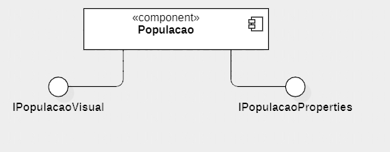

**Ficha Técnica**
item | detalhamento
----- | -----
Classe | Populacao: `com.projeto.game.model.evento` 
Autores | Riccardo Carvalho Sofer e Pedro Carvalho Cintra
Interfaces | `IPopulacao, IPopulacaoProperties, IPopulacaoVisual`

### interfaces 
> interfaces associadas a esse componente

> interface agregador do componente em java
~~~java
package com.projeto.game.model.populacao;

public interface IPopulacao extends IPopulacaoProperties, IPopulacaoVisual {

}
~~~

### Detalhamento das interfaces

#### Interface `IPopulacaoProperties`
Interface responsável pelos métodos relacionados as propriedades da populacao.

~~~java
package com.projeto.game.model.populacao;
…
public interface IPopulacaoProperties {
    public int getNumHabitantes();
    public int getSatisfacao();
    public double getRendaPopulacao();
    
    public void setLabelSatisfacao(Label label);
    public Label getLabelSatisfacao();
    
    public void setLabelPopulacao(Label label);
    public Label getLabelPopulacao();
    
    public void addPopulacao(int num);
    public void addRenda(double num);
    public void addSatisfacao(int num);
}
~~~

Método | Objetivo
-------| --------
`getNumHabitantes` | método que retorna o numHabitantes da populacao.
`getSatisfacao` | método que retorna a satisfacao da populacao.
`getRendaPopulacao` | método que retorna a rendaPopulacao da populacao.
`setLabelSatisfacao` | método que recebe como parâmetro uma Label e a defini no atributo textoSatisfacao da populacao.
`getLabelSatisfacao` | método que retorna o textoSatisfacao da populacao.
`setLabelPopulacao` | método que recebe como parâmetro uma Label e a defini no atributo textoPopulacao da populacao.
`getLabelPopulacao` | método que retorna o textoPopulacao da populacao.
`addPopulacao` | método que recebe como parâmetro um int e o adiciona ao valor do numHabitantes da populacao.
`addRenda` | método que recebe como parâmetro um float e o adiciona ao valor do rendaPopulacao da populacao.
`addSatisfacao` | método que recebe como parâmetro um int e o adiciona ao valor do satisfacao da populacao.

#### Interface `IPopulacaoVisual`
Interface responsável 

~~~java
package com.projeto.game.model.populacao;
…
public interface IPopulacaoVisual {
	public Group criarSatisfacaoVisual();
	public Group criarPopulacaoVisual();
}
~~~

Método | Objetivo
-------| --------
`criarSatisfacaoVisual` | método que.
`criarPopulacaoVisual` | método que.

## Componente `construtorCalendario`
Componente é um componente construtor que realiza as criação do calendario no jogo.

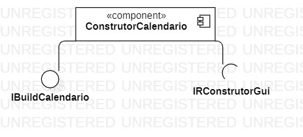

**Ficha Técnica**
item | detalhamento
----- | -----
Classe | ConstrutorCalendario: `com.projeto.game.controller.construtor.calendario` 
Autores | Riccardo Carvalho Sofer e Pedro Carvalho Cintra
Interfaces | `IConstrutorCalendario, IBuildCalendario, IRConstrutorGui`

### interfaces 
> interfaces associadas a esse componente

> interface agregador do componente em java
~~~java
package com.projeto.game.controller.construtor.calendario;

public interface IConstrutorCalendario extends IBuildCalendario, IRConstrutorGui {

}
~~~

### Detalhamento das interfaces

#### Interface `IBuildCalendario`
Interface responsável pela criação do calendario.

~~~java
package com.projeto.game.controller.construtor.calendario;
…
public interface IBuildCalendario {
	public ICalendario buildCalendario();
}
~~~

Método | Objetivo
-------| --------
`buildCalendario` | método que instancia o calendario, defini seu atributo texto e o retorna.

#### Interface `IRConstrutorGui`
Interface responsável por conectar o construtorGui no construtorCalendario .

~~~java
package com.projeto.game.controller.construtor.calendario;
…
public interface IRConstrutorGui {
	public void connect(IFactoryGui construtorGui);

}
~~~

Método | Objetivo
-------| --------
`connect` | método que recebe a interface IFactoryGui como parâmetro e a conecta com o construtorCalendario.

## Componente `construtorCidade`
Componente construtor responsável pela criação da cidade no jogo.

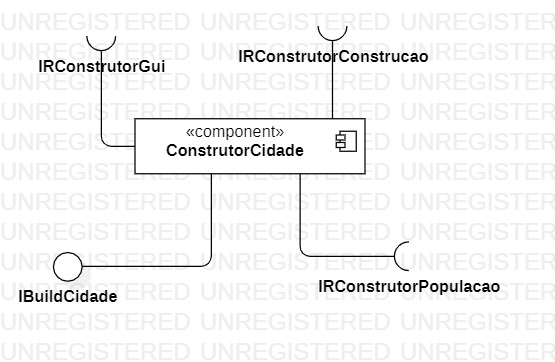

**Ficha Técnica**
item | detalhamento
----- | -----
Classe | ConstrutorCidade: `com.projeto.game.controller.construtor.cidade` 
Autores | Riccardo Carvalho Sofer e Pedro Carvalho Cintra
Interfaces | `IConstrutorCidade, IRConstrutorConstrucao, IRConstrutorGui, IRConstrutorPopulacao, IBuildCidade`

### interfaces 
> interfaces associadas a esse componente

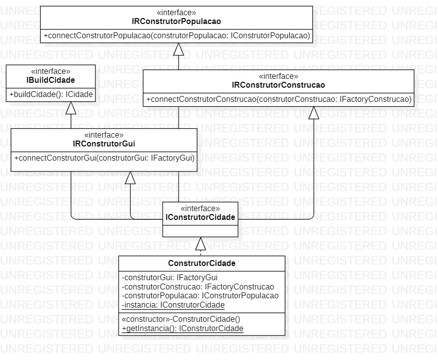

> interface agregador do componente em java
~~~java
package com.projeto.game.controller.construtor.cidade;

public interface IConstrutorCidade extends IRConstrutorConstrucao, IRConstrutorGui, IRConstrutorPopulacao, IBuildCidade {

}
~~~

### Detalhamento das interfaces

#### Interface `IRConstrutorConstrucao`
Interface responsável por conectar o construtorConstrucao no construtorCidade.

~~~java
package com.projeto.game.controller.construtor.cidade;
…
public interface IRConstrutorConstrucao {
	public void connectConstrutorConstrucao(IFactoryConstrucao construtorConstrucao);
}
~~~

Método | Objetivo
-------| --------
`connectConstrutorConstrucao` | método que recebe a interface IFactoryConstrucao como parâmetro e a conecta com o construtorCidade.

#### Interface `IRConstrutorGui`
Interface responsável por conectar o construtorGui no construtorCidade.

~~~java
package com.projeto.game.controller.construtor.cidade;
…
public interface IRConstrutorGui {
	public void connectConstrutorGui(IFactoryGui construtorGui);
}
~~~

Método | Objetivo
-------| --------
`connectConstrutorGui` | método que recebe a interface IFactoryGui como parâmetro e a conecta com o construtorCidade.

#### Interface `IRConstrutorPopulacao`
Interface responsável por conectar o construtorPopulacao no construtorCidade.

~~~java
package com.projeto.game.controller.construtor.cidade;
…
public interface IRConstrutorPopulacao {
	public void connectConstrutorPopulacao(IConstrutorPopulacao construtorPopulacao);
}
~~~

Método | Objetivo
-------| --------
`connectConstrutorPopulacao` | método que recebe a interface IConstrutorPopulacao como parâmetro e a conecta com o construtorCidade.

#### Interface `IBuildCidade`
Interface responsável pela criação da cidade.

~~~java
package com.projeto.game.controller.construtor.cidade;
…
public interface IBuildCidade {
	public ICidade buildCidade();
}
~~~

Método | Objetivo
-------| --------
`buildCidade` | método que instancia a cidade, cria seu layout, conecta a populacao e defini seu dinheiro, seu textoDinheiro e sua renda.

## Componente `construtorConstrucoes`
Componente é um construtor responsável pela criação das construções no jogo

**Ficha Técnica**
item | detalhamento
----- | -----
Classes | ConstrutorConstrucoes: `com.projeto.game.controller.construtor.construcoes`; FactoryConstrucao: `com.projeto.game.controller.construtor.construcoes`
Autores | Riccardo Carvalho Sofer e Pedro Carvalho Cintra
Interfaces | `IFactoryConstrucao, IRConstrutorGui, IBuildConstrucao`

### interfaces 
> interfaces associadas a esse componente

### Detalhamento das interfaces

#### Interface `IFactoryConstrucao`
Interface que extende a interface IRConstrutorGui e é responsável pela criação das contruções, usando o Desing Pattern Factory. 

~~~java
package com.projeto.game.controller.construtor.construcoes;
…
public interface IFactoryConstrucao extends IRConstrutorGui {
	public IConstrucao criarConstrucao(String tipo, int linha, int coluna);
}
~~~

Método | Objetivo
-------| --------
`criarConstrucao` | método que fabrica e retorna uma contrucao.

#### Interface `IRConstrutorGui`
Interface responsável por conectar o construtorGui no construtorConstrucoes.

~~~java
package com.projeto.game.controller.construtor.construcoes;
…
public interface IRConstrutorGui {
	public void connect(IFactoryGui fabrica);
}
~~~

Método | Objetivo
-------| --------
`connect` |  método que recebe a interface IFactoryGui como parâmetro e a conecta com o construtorConstrucoes.

#### Interface `IBuildConstrucao`
Interface responsável pela criação das construções.

~~~java
package com.projeto.game.controller.construtor.construcoes;
…
public interface IBuildConstrucao {
	public Escola buildEscola(int linha, int coluna);
	public Hospital buildHospital(int linha, int coluna);
	public Industria buildIndustria(int linha, int coluna);
	public Mercado buildMercado(int linha, int coluna);
	public Moradia buildMoradia(int linha, int coluna);
	public Prefeitura buildPrefeitura(int linha, int coluna);
	public Vazio buildVazio(int linha, int coluna);
}
~~~

Método | Objetivo
-------| --------
`buildEscola` | método instancia uma Escola e defini sua posição e sua estado construido.
`buildHospital` | método instancia uma Hospital e defini sua posição e sua estado construido.
`buildIndustria` | método instancia uma Industria e defini sua posição e sua estado construido.
`buildMercado` | método instancia uma Mercado e defini sua posição e sua estado construido.
`buildMoradia` | método instancia uma Moradia e defini sua posição e sua estado construido.
`buildPrefeitura` | método instancia uma Prefeitura e defini sua posição e sua estado construido.
`buildVazio` | método instancia uma Vazio e defini sua posição e sua estado construido.

## Componente `construtorGerador`
Componente construtor responsável pela criação do gerador de eventos no jogo.

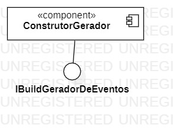

**Ficha Técnica**
item | detalhamento
----- | -----
Classe | ConstrutorConstrutorGeradorDeEventos: `com.projeto.game.controller.construtor.gerador`
Autores | Riccardo Carvalho Sofer e Pedro Carvalho Cintra
Interfaces | `IConstrutorConstrutorGeradorDeEventos, IBuildGeradorDeEventos`

### interfaces 
> interfaces associadas a esse componente

> interface agregador do componente em java
~~~java
package com.projeto.game.controller.construtor.gerador;

public interface IConstrutorConstrutorGeradorDeEventos extends IBuildGeradorDeEventos{
    
}
~~~

### Detalhamento das interfaces

#### Interface `IBuildGeradorDeEventos`
Interface que cria o construtorGeradorDeEventos

~~~java
package com.projeto.game.controller.construtor.gerador;
…
public interface IBuildGeradorDeEventos {
    public IConstrutorGeradorDeEventos buildGeradorDeEventos();
}
~~~

Método | Objetivo
-------| --------
`buildGeradorDeEventos` | método que instancia e retorna o construtorGeradorDeEventos.

## Componente `construtorGui`
Componente construtor responsável pela criação dos elementos de GUI no jogo.

**Ficha Técnica**
item | detalhamento
----- | -----
Classes | FactoryGui: `com.projeto.game.controller.construtor.gui`; ConstrutorBotao: `com.projeto.game.controller.construtor.gui`; ConstrutorDialog: `com.projeto.game.controller.construtor.gui`; ConstrutorJanela: `com.projeto.game.controller.construtor.gui`; ConstrutorLabel: `com.projeto.game.controller.construtor.gui`; 
Autores | Riccardo Carvalho Sofer e Pedro Carvalho Cintra
Interfaces | `IFactoryGui, IRControle, IBuildBotao, IBuildDialog, IBuildJanela, IBuildLabel`

### interfaces 
> interfaces associadas a esse componente

### Detalhamento das interfaces

#### Interface `IFactoryGui`
Interface que extende a interface IRControle e é responsável pela criação de elementos da GUI (graphical user interface), usando o Desing Pattern Factory.

~~~java
package com.projeto.game.controller.construtor.gui;
…
public interface IFactoryGui extends IRControle {
	public Button criarBotao(String tipo, String texto, float largura, float altura, int linha, int coluna);
	public Window criarJanela(String tipo, String titulo, String texto, float largura, float altura, int linha, int coluna);
	public Label criarLabel(String texto, float tamanhoFonte, String estilo);
	public Dialog criarDialog(String titulo, String texto, float tamanhoFonte, float largura, float altura);
}
~~~

Método | Objetivo
-------| --------
`criarBotao` | método que aciona a criação de um Button atraves de do ConstrutorBotao.
`criarJanela` | método que aciona a criação de uma Window atraves de do ConstrutorJanela.
`criarLabel` | método que aciona a criação de uma Label atraves de do ConstrutorLabel.
`criarDialog` | método que aciona a criação de um Dialog atraves de do ConstrutorDialog.

#### Interface `IRControle`
Interface responsável por conectar o subControleCidade no construtorGui.

~~~java
package com.projeto.game.controller.construtor.gui;
…
public interface IRControle {
	public void connect(ISubControleCidade controle);
}
~~~

Método | Objetivo
-------| --------
`connect` | método que recebe a interface ISubControleCidade como parâmetro e a conecta com o construtorGui.

#### Interface `IBuildBotao`
Interface responsável pela criação de botões.

~~~java
package com.projeto.game.controller.construtor.gui;
…
public interface IBuildBotao extends IRControle {
	public Button buildBotaoTexto(String texto, float largura, float altura);
	public Button buildBotaoImagemVazio(float largura, float altura);
	public Button buildBotaoImagem(TextureRegionDrawable image, float largura, float altura, int linha, int coluna, String tipo);
	public Button buildBotaoDestruir(String texto, float largura, float altura, int linha, int coluna, String tipo);

}
~~~

Método | Objetivo
-------| --------
`buildBotaoTexto` | método que instancia um TextButton com o texto fornecido, defini seu tamanho com as dimensões dadas e o retorna.
`buildBotaoImagemVazio` | método que instancia um ImageButton, defini seu tamanho, através dos parâmetros passados, e o retorna.
`buildBotaoImagem` | método que instancia um ImageButton usando um novoEstilo criado a partir do parâmetro TextureRegionDrawable, defini seu tamanho e o retorna.
`buildBotaoDestruir` | método que cria o bota destruir apartir dos parêmtros fornecidos.

#### Interface `IBuildDialog`
Interface responsável pela criação de dialogs

~~~java
package com.projeto.game.controller.construtor.gui;
…
public interface IBuildDialog {
	public Dialog buildDialog(String titulo, float largura, float altura);
}
~~~

Método | Objetivo
-------| --------
`buildDialog` | método que instancia um Dialog com o titulo fornecido, defini seu tamanho com as dimensões dadas e o retorna.

#### Interface `IBuildJanela`
Interface responsável por conectar o subControleCidade no construtorGui.

~~~java
package com.projeto.game.controller.construtor.gui;
…
public interface IBuildJanela {
	public Window buildJanela(String titulo, float largura, float altura);
}
~~~

Método | Objetivo
-------| --------
`buildJanela` | método que instancia uma Window com o titulo fornecido, defini seu tamanho com as dimensões dadas e a retorna.

#### Interface `IBuildLabel`
Interface responsável por conectar o subControleCidade no construtorGui.

~~~java
package com.projeto.game.controller.construtor.gui;
…
public interface IBuildLabel {
	public Label criarLabel(String texto, float tamanhoFonte, String estilo);
}
~~~

Método | Objetivo
-------| --------
`connect` | método que instancia uma Label com o texto fornecido, defini o tamanho e estilo da fonte com as informações dadas e a retorna.

## Componente `construtorPopulacao`
Componente construtor que cria a população durante o jogo.

**Ficha Técnica**
item | detalhamento
----- | -----
Classe | ConstrutorPopulacao: `com.projeto.game.controller.construtor.populacao`
Interfaces | `IConstrutorPopulacao, IBuildPopulacao, IRConstrutorGui`

### interfaces 
> interfaces associadas a esse componente

> interface agregador do componente em java
~~~java
package com.projeto.game.controller.construtor.populacao;

public interface IConstrutorPopulacao extends IBuildPopulacao, IRConstrutorGui {

}
~~~

### Detalhamento das interfaces

#### Interface `IBuildPopulacao`
Interface responsável pela criação da populacao.

~~~java
package com.projeto.game.controller.construtor.populacao;
…
public interface IBuildPopulacao {
	public IPopulacao buildPopulacao();
}
~~~

Método | Objetivo
-------| --------
`buildPopulacao` | método que instancia a populacao, defini o textoPopulacao e o textoSatisfacao e a retorna.

#### Interface `IRConstrutorGui`
Interface responsável por conectar o construtorGui no construtorPopulacao.

~~~java
package com.projeto.game.controller.construtor.populacao;
…
public interface IRConstrutorGui {
	public void connect(IFactoryGui construtorGui);
}
~~~

Método | Objetivo
-------| --------
`connect` | método que recebe a interface IFactoryGui como parâmetro e a conecta com o construtorPopulacao.

## Componente `subcontrolesCalendario`
Componente de controle responsável por realizar os comando relacionados ao calendario.

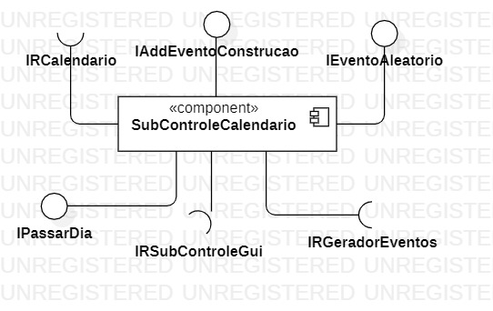

**Ficha Técnica**
item | detalhamento
----- | -----
Classe | SubControleCalendario: `com.projeto.game.controller.controle.subcontroles.calendario`
Interfaces | `ISubControleCalendario, IRSubControleGui, IRGeradorEventos, IRCalendario, IEventoAleatorio, IPassarDia, IAddEventoConstrucao `

### interfaces 
> interfaces associadas a esse componente

> interface agregador do componente em java
~~~java
package com.projeto.game.controller.controle.subcontroles.calendario;

public interface ISubControleCalendario extends IRSubControleGui, IRGeradorEventos, IRCalendario, IEventoAleatorio, IPassarDia, IAddEventoConstrucao {

}
~~~

### Detalhamento das interfaces

#### Interface `IRSubControleGui`
Interface responsável por conectar o subcontrolesGui no subcontrolesCalendario.

~~~java
package com.projeto.game.controller.controle.subcontroles.calendario;
…
public interface IRSubControleGui {
	public void connectSubControleGui(ISubControleGui subControleGui);
}
~~~

Método | Objetivo
-------| --------
`connectSubControleGui` | método que recebe a interface ISubControleGui como parâmetro e a conecta com o subcontrolesCalendario.

#### Interface `IRGeradorEventos`
Interface responsável por conectar o geradorDeEventos no subcontrolesCalendario.

~~~java
package com.projeto.game.controller.controle.subcontroles.calendario;
…
public interface IRGeradorEventos {
	public void connectGeradorEventos(IConstrutorGeradorDeEventos geradorEventos);
}
~~~

Método | Objetivo
-------| --------
`connectGeradorEventos` | método que recebe a interface IConstrutorGeradorDeEventos como parâmetro e a conecta com o subcontrolesCalendario.

#### Interface `IRCalendario`
Interface responsável por conectar o calendario no subcontrolesCalendario.

~~~java
package com.projeto.game.controller.controle.subcontroles.calendario;
…
public interface IRCalendario {
	public void connectCalendario(ICalendario calendario);
}
~~~

Método | Objetivo
-------| --------
`connectCalendario` | método que recebe a interface ICalendario como parâmetro e a conecta com o subcontrolesCalendario.

#### Interface `IEventoAleatorio`
Interface responsável por acionar a criação de um novo evento aleatorio.

~~~java
package com.projeto.game.controller.controle.subcontroles.calendario;

public interface IEventoAleatorio {
	public void eventoAleatorio();
}
~~~

Método | Objetivo
-------| --------
`eventoAleatorio` | método que aciona a geração de um eventoAleatorio, adiciona esse evento no calendario e aciona o subContrleGui para que ele adicione um Dialog para o evento.

#### Interface `IPassarDia`
Interface responsável por acionar a passagem de dia no calendario.

~~~java
package com.projeto.game.controller.controle.subcontroles.calendario;

public interface IPassarDia {
	public void passarDia();
}
~~~

Método | Objetivo
-------| --------
`passarDia` | método que confere se é o calendario está em um dia de geração de evento aleatorio e aciona a passagem de dia no calendario.

#### Interface `IAddEventoConstrucao `
Interface responsável por adicionar um eventoConstrucao no calendario.

~~~java
package com.projeto.game.controller.controle.subcontroles.calendario;
…
public interface IAddEventoConstrucao {
	public void addEventoConstrucao(IConstrucao construcao, int prefeituraConstruida);
}
~~~

Método | Objetivo
-------| --------
`addEventoConstrucao` | método que aciona a criação de um eventoConstrucao da construcao fornecida e adiciona esse evento no calendario.

## Componente `subcontrolesCidade`
Componente de controle responsável pelos comandos relacionados a cidade.

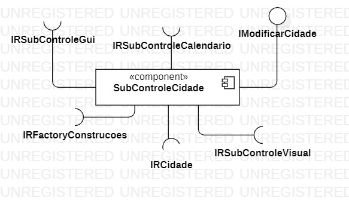

**Ficha Técnica**
item | detalhamento
----- | -----
Classe | SubControleCidade: `com.projeto.game.controller.controle.subcontroles.cidade`
Interfaces | `ISubControleCidade, IRCidade, IRFactoryConstrucoes, IRSubControleCalendario, IRSubControleGui, IRSubControleVisual, IModificarCidade`

### interfaces 
> interfaces associadas a esse componente

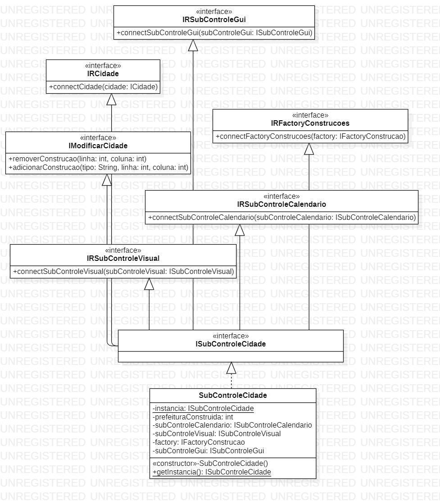

> interface agregador do componente em java
~~~java
package com.projeto.game.controller.controle.subcontroles.cidade;

public interface ISubControleCidade extends IRCidade, IRFactoryConstrucoes, IRSubControleCalendario, IRSubControleGui, IRSubControleVisual, IModificarCidade {

}
~~~

### Detalhamento das interfaces

#### Interface `IRCidade`
Interface responsável por conectar a cidade no subcontrolesCidade.

~~~java
package com.projeto.game.controller.controle.subcontroles.cidade;
…
public interface IRCidade {
	public void connectCidade(ICidade cidade);
}
~~~

Método | Objetivo
-------| --------
`connectCidade` | método que recebe a interface ICidade como parâmetro e a conecta com o subcontrolesCidade.

#### Interface `IRFactoryConstrucoes`
Interface responsável por conectar a FactoryConstrucao no subcontrolesCidade.

~~~java
package com.projeto.game.controller.controle.subcontroles.cidade;
…
public interface IRFactoryConstrucoes {
	public void connectFactoryConstrucoes(IFactoryConstrucao factory);
}
~~~

Método | Objetivo
-------| --------
`connectFactoryConstrucoes` | método que recebe a interface IFactoryConstrucao como parâmetro e a conecta com o subcontrolesCidade.

#### Interface `IRSubControleCalendario`
Interface responsável por conectar o SubControleCalendario no subcontrolesCidade.

~~~java
package com.projeto.game.controller.controle.subcontroles.cidade;
…
public interface IRSubControleCalendario {
	public void connectSubControleCalendario(ISubControleCalendario subControleCalendario);
}
~~~

Método | Objetivo
-------| --------
`connectSubControleCalendario` | método que recebe a interface ISubControleCalendario como parâmetro e a conecta com o subcontrolesCidade.

#### Interface `IRSubControleGui`
Interface responsável por conectar o SubContrleGui no subcontrolesCidade.

~~~java
package com.projeto.game.controller.controle.subcontroles.cidade;
…
public interface IRSubControleGui  {
	public void connectSubControleVisual (ISubControleGui subControleGui);
}
~~~

Método | Objetivo
-------| --------
`connectSubControleVisual ` | método que recebe a interface ISubControleGui como parâmetro e a conecta com o subcontrolesCidade.

#### Interface `IRSubControleVisual`
Interface responsável por conectar o SubContrleVizual no subcontrolesCidade.

~~~java
package com.projeto.game.controller.controle.subcontroles.cidade;
…
public interface IRSubControleVisual   {
	public void connectSubControleVisual (ISubControleVisual subControleVisual);
}
~~~

Método | Objetivo
-------| --------
`connectSubControleVisual ` | método que recebe a interface ISubControleVisual como parâmetro e a conecta com o subcontrolesCidade.

#### Interface `IModificarCidade`
Interface responsável por acionar a criação e destruição de uma construcao.

~~~java
package com.projeto.game.controller.controle.subcontroles.cidade;

public interface IModificarCidade {
    public void construirConstrucao(String tipo, int linha, int coluna);
    public void removerConstrucao(int linha, int coluna);
}
~~~

Método | Objetivo
-------| --------
`construirConstrucao ` | método que aciona a criação de uma construcao fornecendo à fabrica os parametros recebidos.
`removerConstrucao ` | método que aciona a remoção de uma cidade fornecendo a cidade os parametros recebidos.

## Componente `subcontrolesGui`
Componente de controle responsável pelos comandos relacionados a GUI.

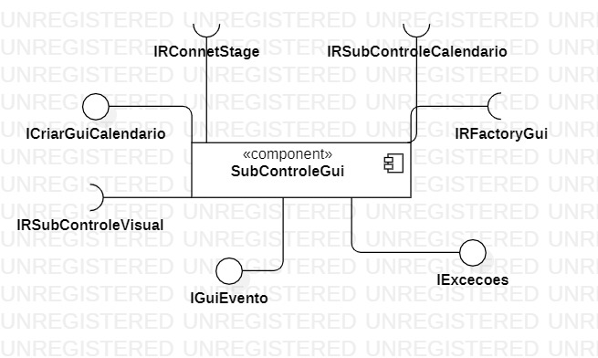

**Ficha Técnica**
item | detalhamento
----- | -----
Classe | SubControleGui: `com.projeto.game.controller.controle.subcontroles.gui`
Interfaces | `ISubControleGui, IRSubControleVisual, IRFactoryGui, IRConnectStage, IRSubControleCalendario, ICriarGuiCalendario, IGuiEvento, IExcecoes`

### interfaces 
> interfaces associadas a esse componente

> interface agregador do componente em java
~~~java
package com.projeto.game.controller.controle.subcontroles.gui;

public interface ISubControleGui extends IRSubControleVisual, IRFactoryGui, IRConnectStage, IRSubControleCalendario, ICriarGuiCalendario, IGuiEvento, IExcecoes {

}
~~~

### Detalhamento das interfaces

#### Interface `IRSubControleVisual`
Interface responsável por conectar o SubControleVisual no subcontrolesGui.

~~~java
package com.projeto.game.controller.controle.subcontroles.gui;
…
public interface IRSubControleVisual {
	public void connectSubControleVisual(ISubControleVisual subControleVisual);
}
~~~

Método | Objetivo
-------| --------
`connectSubControleVisual` | método que recebe a interface ICidade como parâmetro e a conecta com o subcontrolesGui.

#### Interface `IRFactoryGui`
Interface responsável por conectar a FactoryGui no subcontrolesGui.

~~~java
package com.projeto.game.controller.controle.subcontroles.gui;
…
public interface IRFactoryGui  {
	public void connectFactoryGui(IFactoryGui factory);
}
~~~

Método | Objetivo
-------| --------
`connectFactoryGui` | método que recebe a interface IFactoryGui como parâmetro e a conecta com o subcontrolesGui.

#### Interface `IRConnectStage`
Interface responsável por conectar o stage no subcontrolesGui.

~~~java
package com.projeto.game.controller.controle.subcontroles.gui;
…
public interface IRConnectStage {
	public void connectStage(Stage stage);
}
~~~

Método | Objetivo
-------| --------
`connectStage` | método que recebe o Stage como parâmetro e a conecta com o subcontrolesGui.

#### Interface `IRSubControleCalendario`
Interface responsável por conectar o stage no subcontrolesGui.

~~~java
package com.projeto.game.controller.controle.subcontroles.gui;
…
public interface IRSubControleCalendario {
	public void connectSubControleCalendario(ISubControleCalendario subControleCalendario);
}
~~~

Método | Objetivo
-------| --------
`connectSubControleCalendario` | método que recebe a interface ISubControleCalendario como parâmetro e a conecta com o subcontrolesGui.

#### Interface `ICriarGuiCalendario`
Interface responsável pelo vizual do botao passarDia.

~~~java
package com.projeto.game.controller.controle.subcontroles.gui;
…
public interface ICriarGuiCalendario {
	public Button adicionarBotaoPassarDia();
}
~~~

Método | Objetivo
-------| --------
`adicionarBotaoPassarDia` | método que aciona a criação de um botao passarDia por meio da do construtorGui e o retorna.

#### Interface `IGuiEvento`
Interface responsável pela vizualização dos eventos aleatorios.

~~~java
package com.projeto.game.controller.controle.subcontroles.gui;
…
public interface IGuiEvento {
	public void adicionarDialogoEvento(IEvento eventoAleatorio);
}
~~~

Método | Objetivo
-------| --------
`adicionarDialogoEvento` | método que cria e mostra um Dialog de acordo com o eventoAleatorio fornecido no parâmetro.

#### Interface `IExcecoes`
Interface responsável pela vizualização das execoes encontradas.

~~~java
package com.projeto.game.controller.controle.subcontroles.gui;

public interface IExcecoes {
	public void adicionarDialogoExcecao(String error);
}
~~~

Método | Objetivo
-------| --------
`adicionarDialogoExcecao` | método que cria e mostra um Dialog com o erro fornecido no parâmetro.

## Componente `subcontrolesVisual`
Componente de controle responsável pelos comandos relacionados ao visual do jogo.

**Ficha Técnica**
item | detalhamento
----- | -----
Classe | SubControleVisual: `com.projeto.game.controller.controle.subcontroles.visual`
Interfaces | `ISubControleVisual, IRFactoryGui, IRConnectStage, IRConnectSubControleGui, IRConnectViews, IAtualizar`

### interfaces 
> interfaces associadas a esse componente

> interface agregador do componente em java
~~~java
package com.projeto.game.controller.controle.subcontroles.visual;

public interface ISubControleVisual extends IRFactoryGui, IRConnectStage, IRConnectSubControleGui, IRConnectViews, IAtualizar {
	…
}
~~~

### Detalhamento das interfaces

#### Interface `IRFactoryGui`
Interface responsável por conectar a FactoryGui no subcontrolesVisual.

~~~java
package com.projeto.game.controller.controle.subcontroles.visual;
…
public interface IRFactoryGui {
	public void connectFactoryGui(IFactoryGui factory);

}
~~~

Método | Objetivo
-------| --------
`connectFactoryGui` | método que recebe a interface IFactoryGui como parâmetro e a conecta com o subcontrolesVisual.

#### Interface `IRConnectStage`
Interface responsável por conectar o satge no subcontrolesVisual.

~~~java
package com.projeto.game.controller.controle.subcontroles.visual;
…
public interface IRConnectStage {
	public void connectStage(Stage stage);
}
~~~

Método | Objetivo
-------| --------
`connectStage` | método que recebe o Stage como parâmetro e a conecta com o subcontrolesVisual.

#### Interface `IRConnectSubControleGui`
Interface responsável por conectar o SubContrleGui no subcontrolesVisual.

~~~java
package com.projeto.game.controller.controle.subcontroles.visual;
…
public interface IRConnectSubControleGui {
	public void connectSubControleGui(ISubControleGui subControleGui);
}
~~~

Método | Objetivo
-------| --------
`connectSubControleGui` | método que recebe a interface ISubControleGui como parâmetro e a conecta com o subcontrolesVisual.

#### Interface `IRConnectViews`
Interface responsável por conectar o viewCidade, o viewPopulacao e o viewCalendario no subcontrolesVisual.

~~~java
package com.projeto.game.controller.controle.subcontroles.visual;
…
public interface IRConnectViews {
	public void connectViewCidade(IViewCidade viewCidade);
	public void connectViewPopulacao(IViewPopulacao viewPopulacao);
	public void connectViewCalendario(IViewCalendario viewCalendario);
}
~~~

Método | Objetivo
-------| --------
`connectViewCidade` | método que recebe a interface IViewCidade como parâmetro e a conecta com o subcontrolesVisual.
`connectViewPopulacao` | método que recebe a interface IViewPopulacao como parâmetro e a conecta com o subcontrolesVisual.
`connectViewCalendario` | método que recebe a interface IViewCalendario como parâmetro e a conecta com o subcontrolesVisual.

#### Interface `IAtualizar`
Interface responsável por atualizar a tela de jogo.

~~~java
package com.projeto.game.controller.controle.subcontroles.visual;

public interface IAtualizar {
	public void atualizar();
    public void atualizarVisualCidade();
    public void atualizarVisualPopulacao();
    public void atualizarVisualCalendario();
}
~~~

Método | Objetivo
-------| --------
`atualizar` | método que aciona a atuzalização da cidade, da populacao e do calendario.
`atualizarVisualCidade` | método que atualiza a cidade na tela de jogo.
`atualizarVisualPopulacao` | método que atualiza a populacao na tela de jogo.
`atualizarVisualCalendario` | método que atualiza a calendario na tela de jogo.

## Componente `viewCalendario`
Componente de view responsável pelos criações visuais do calendario.

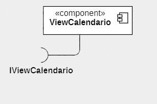

**Ficha Técnica**
item | detalhamento
----- | -----
Classe | ViewCalendario: `com.projeto.game.view.calendario`
Interfaces | `IViewCalendario, IRCalendario`

### interfaces 
> interfaces associadas a esse componente

> interface agregador do componente em java
~~~java
package com.projeto.game.view.calendario;
…
public interface IViewCalendario extends IRCalendario {
	public Group getVisual();

}
~~~

### Detalhamento das interfaces

#### Interface `IRCalendario`
Interface responsável por conectar o calendario no viewCalendario.

~~~java
package com.projeto.game.view.calendario;
…
public interface IRCalendario {
	public void connect(ICalendario calendario);
}
~~~

Método | Objetivo
-------| --------
`connect` | método que recebe a interface ICalendario como parâmetro e o conecta com o viewCalendario.

## Componente `viewCidade`
Componente de view responsável pelas criações visuais da cidade.

**Ficha Técnica**
item | detalhamento
----- | -----
Classe | ViewCidade: `com.projeto.game.view.cidade`
Interfaces | ` IViewCidade, IRCidade`

### interfaces 
> interfaces associadas a esse componente

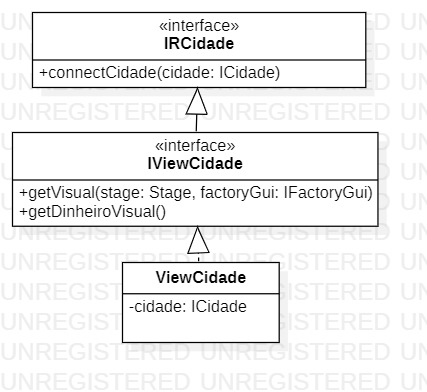

> interface agregador do componente em java
~~~java
package com.projeto.game.view.cidade;
…
public interface IViewCidade extends IRCidade {
	…
}
~~~

### Detalhamento das interfaces

#### Interface `IRCidade`
Interface responsável por conectar a cidade no viewCidade.

~~~java
package com.projeto.game.view.cidade;
…
public interface IRCidade {
	public void connectCidade(ICidade cidade);
}
~~~

Método | Objetivo
-------| --------
`connectCidade` | método que recebe a interface ICidade como parâmetro e a conecta com o viewCidade.

## Componente `viewConstrucao`
Componente de view responsável pelas criações visuais das construções.

**Ficha Técnica**
item | detalhamento
----- | -----
Classe | ViewConstrucao: `com.projeto.game.view.construcao`
Interfaces | `IViewConstrucao, IRConstrucao, IRStage, IRGui`

### interfaces 
> interfaces associadas a esse componente

> interface agregador do componente em java
~~~java
package com.projeto.game.view.construcao;
…
public interface IViewConstrucao extends IRConstrucao, IRStage, IRGui {
	…
}
~~~

### Detalhamento das interfaces

#### Interface `IRConstrucao`
Interface responsável por conectar a construcao no viewConstrucao.

~~~java
package com.projeto.game.view.construcao;
…
public interface IRConstrucao {
	public void connect(IConstrucao construcao);
}
~~~

Método | Objetivo
-------| --------
`connect` | método que recebe a interface IConstrucao como parâmetro e a conecta com o viewConstrucao.

#### Interface `IRStage`
Interface responsável por conectar o stage no viewConstrucao.

~~~java
package com.projeto.game.view.construcao;
…
public interface IRStage {
	public void connectStage(Stage stage);
}
~~~

Método | Objetivo
-------| --------
`connectStage` | método que recebe a interface Stage como parâmetro e a conecta com o viewConstrucao.

#### Interface `IRGui`
Interface responsável por conectar a FactorGui no viewConstrucao.

~~~java
package com.projeto.game.view.construcao;
…
public interface IRGui {
	public void connectGui(IFactoryGui factoryGui);
}
~~~

Método | Objetivo
-------| --------
`connectGui` | método que recebe a interface IFactoryGui como parâmetro e a conecta com o viewConstrucao.

## Componente `viewPopulacao`
Componente de view responsável pelas criações visuais da população.

**Ficha Técnica**
item | detalhamento
----- | -----
Classe | ViewPopulacao: `com.projeto.game.view.populacao`
Interfaces | `IViewPopulacao, IRPopulacao`

### interfaces 
> interfaces associadas a esse componente

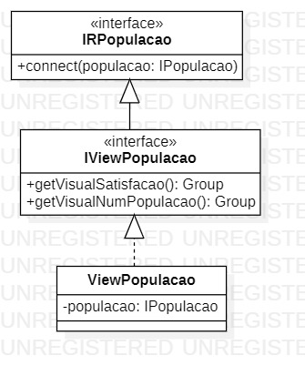

> interface agregador do componente em java
~~~java
package com.projeto.game.view.populacao;
…
public interface IViewPopulacao extends IRPopulacao {
	…
}
~~~

### Detalhamento das interfaces

#### Interface `IRPopulacao`
Interface responsável por conectar a populacao no viewConstrucao.

~~~java
package com.projeto.game.view.populacao;
…
public interface IRPopulacao {
	public void connect(IPopulacao populacao);
}
~~~

Método | Objetivo
-------| --------
`connect` | método que recebe a interface IPopulacao como parâmetro e a conecta com o viewPopulacao.

# Destaques de Orientação a Objetos
Conceitos de OO utilizados no códgigo (sobrecarga de métodos, polimorfismo ...)

## Diagrama de Classes usada no destaque

## Código do Destaque

~~~java
// Recorte do código do destaque OO
public void algoInteressante(…) {
   …
   trechoInteressante = 100;
}
~~~

# Destaques de Pattern
Foi adotado pela equipe, essencialmente, os seguintes Desing Patterns:
* Singleton
* Factory
* Strategy

## Desing Pattern 1: Singleton
O Pattern Singleton foi utilizado no projeto para gerar mais coesão ao código e evitar que determinados objetos sejam instanciados mais de uma vez. O padrão foi utilizado inúmeras vezes no código estando presente em quase todos os componentes. Não possui esse Pattern apenas componentes e classes que precisam ser instanciadas mais de uma vez (Componente `construcao` e Componente `eventos`)... 

### Diagrama do Pattern 1

### Exemplo de Código do Pattern 1
Esse exemplo representa o uso do Singleton no projeto, no caso do exemplo, para o instanciação da Populacao, seguindo o mesmo padrão para o restante do código.

1. O trecho de código foi retirado do Componente `populacao` e representa como foi estruturado o Pattern:
~~~java
package com.projeto.game.model.populacao;
…
public class Populacao implements IPopulacao{
   …
   private static IPopulacao instancia;
    …
   public static IPopulacao getInstancia() {
    	if ( instancia == null ) {
    		instancia = new Populacao();
    	}
    	return instancia;
    }
}
~~~

## Desing Pattern 2: Factory
O Pattern Factory foi utilizado no projeto para substituir chamadas diretas de instanciação promovendo uma organização do código no que diz respeito a criação dos objetos. As "fábricas"
foram utilizadas, fundamentalmente, em três momentos do código: Na construção de construções e na construção de elementos de GUI (graphical user interface).

### Diagramas do Pattern 2 
#### 

### Códigos do Pattern 2
Recortes de código da implementação das Factorys que demonstram como elas foram estruturadas.

1. Trecho de código retirado do Componente `construtor` e representa como foi feita a "fábrica" de construções: 
~~~java
package com.projeto.game.controller.construtor.construcoes;
…
public class FactoryConstrucao implements IFactoryConstrucao {
	final static private IBuildConstrucao CONSTRUTOR_CONSTRUCAO = ConstrutorConstrucao.getInstancia();
	…
	public IConstrucao criarConstrucao(String tipo, int linha, int coluna) {
		IConstrucao construcao;
		
		switch (tipo) {
			case "Moradia":
				construcao = CONSTRUTOR_CONSTRUCAO.buildMoradia(linha,coluna);
				…
				break;
			…
			default:
				construcao = CONSTRUTOR_CONSTRUCAO.buildVazio(linha,coluna);
				…
				break;
		}
		…
		return construcao;
	}
	…
}
~~~

2. Trecho de código retirado do Componente `construtor` e representa como foi feita a "fábrica" de elementos de GUI: 
~~~java
package com.projeto.game.controller.construtor.gui;
…
public class FactoryGui implements IFactoryGui {
    …
	public Button criarBotao(String tipo, String texto, float largura, float altura, int linha, int coluna) {
		Button botao;
		switch (tipo) {
		case "texto":
			botao = CONSTRUTOR_BOTAO.buildBotaoTexto(texto, largura, altura);
			break;
		…
		default:
			botao = null;
			break;
		}
		return botao;
	}
	
	public Window criarJanela(String tipo, String titulo, String texto, float largura, float altura, int linha, int coluna) {
		Window janela;
		
		String[] icones = {"Moradia", "Escola", "Hospital", "Industria", "Mercado", "Prefeitura"};
		
		switch (tipo) {
			case "texto":
				janela = CONSTRUTOR_JANELA.buildJanela(titulo, largura, altura);
				…
				break;
			case "construcao":
				janela = CONSTRUTOR_JANELA.buildJanela(titulo, largura, altura);
				…
				break;
			default:
				janela = null;
		}
		return janela;
	}
	…
}
~~~
Observação: o `FactoryGui` também implementa as funções de construção `criarLabel` e `criarDialog`.

## Desing Pattern 3: Strategy
O Pattern Strategy foi utilizado no projeto para fazer com que determinada classe (`EventoAleatorio`) possua algoritmos intercambiáveis, ou seja, fazer com que essa clase posso surtir diferentes efeitos (através dos diferentes algoritmos) sem que ela defina os algoritmos para isso. 

### Diagrama do Pattern 3

### Código do Pattern 3
Recortes de código da implementação da Strategy que demonstram sua definição e funionamento.

1. Trecho do código retirado do Componente `evento` e reprensenta como foi definida a Classe `EventoAleatorio`:
~~~java
package com.projeto.game.model.evento;
…
public class EventoAleatorio extends Evento {
	private IStrategyEventoAleatorio strategy;
	…
	public void executarEvento(ICidade cidade) {
		strategy.executarEventoAleatorio(cidade);
	}
}
~~~

2. Trecho do código retirado do Componente `evento` e representa como foi definida a Interface `IStrategyEventoAleatorio`:
~~~java
package com.projeto.game.model.evento;
…
public interface IStrategyEventoAleatorio {
	public void executarEventoAleatorio(ICidade cidade);
}
~~~

3. Trecho do código retirado do Componente `gerador` e representa como foi utilizado o Strategy:
~~~java
package com.projeto.game.model.gerador;
…
public class GeradorEventoAleatorio implements IGerarEventoAleatorio {
    …
    public EventoAleatorio gerarEventoAleatorio(int data){
        EventoAleatorio eventoAleatorio = new EventoAleatorio();
        IStrategyEventoAleatorio strategy;
        …
        switch (n) {
          case 1:
              strategy = new EventoAleatorioGreveGeral();
              break;
          …
          default:
              strategy = new EventoAleatorioMigracao();
        	  break;
        }
        …
        eventoAleatorio.setStrategy(strategy);
        …
    }
    …
~~~
Observação : As funções `EventoAleatorioGreveGeral` e `EventoAleatorioRepasseEstadual` (além de outras que não aprecem no trecho) definem os diferentes algoritmos a serem permutados pela Strategy e atribuídos no objeto gerado `eventoAleatorio`.    

# Plano de Exceções

## Diagrama de hierarquia de exceções

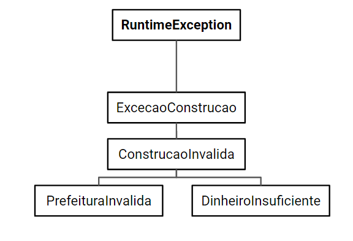

## Descrição das classes de exceções

Classe | Descrição
----- | -----
ExcecaoConstrucao | Engloba todas as exceções relacionadas a construções.
ConstrucaoInvalida | Indica que houve um erro no posicionamento ou remoção de uma construção.
PrefeituraInvalida | Indica não se pôde construir uma prefeitura por ela já estar na cidade.
DinheiroInsuficiente | Indica não há dinheiro suficiente para realizar uma construção.

